[**English**](#english) | [**简体中文**](#简体中文)

---

<a id="english"></a>

# Super Search (Lightning-Fast Local Search Tool)


Super Search is a lightning-fast local file retrieval tool developed in Python for Windows. Designed to provide a millisecond-level search experience similar to "Everything," it not only features blazing-fast file searching capabilities but also deeply integrates with **Windows underlying APIs** to support comprehensive Recycle Bin management and real-time, unobtrusive file system monitoring.

## ✨ Core Features

* ⚡ **Lightning-Fast Loading & Retrieval**: Utilizes a memory-based dictionary (`Dict`) for O(1) complexity deduplication and retrieval. Combined with local snapshot caching (`.pkl`), it achieves instant application startup.
* ♻️ **Deep Recycle Bin Integration**: Eliminates the blind spots of conventional search software by deeply integrating with Windows COM interfaces. It allows you to directly **view, restore, and permanently shred** Recycle Bin files from the search results, or even empty the Recycle Bin with one click.
* 👀 **Real-Time Directory Monitoring**: Powered by the `watchdog` engine, it monitors local file creations, deletions, and movements (e.g., on the Desktop) in real-time, enabling hot updates of index data and silent debounced refreshing.
* 🗂️ **Smart Categorization & Filtering**: Built-in rich format dictionaries allow one-click categorization and retrieval of images, videos, audio, documents, archives, and code files.
* 💻 **Unobtrusive Background Experience**: Integrates `pystray` to support one-click minimization to the system tray. It runs silently in the background without interrupting your workflow and can be awakened at any time.

## 📸 Interface Preview & Usage Guide

This tool features an out-of-the-box design concept, providing a lightning-fast search experience without complex configurations.

> **💡 Highly Recommended: Run as [Administrator] on your first launch.** > Due to Windows permission isolation mechanisms, running as an administrator maximizes the traversal of the underlying directory structure. According to our benchmark testing, administrator mode can scan nearly **80,000 additional** deep or system-level files, ensuring your search has absolutely "no blind spots."

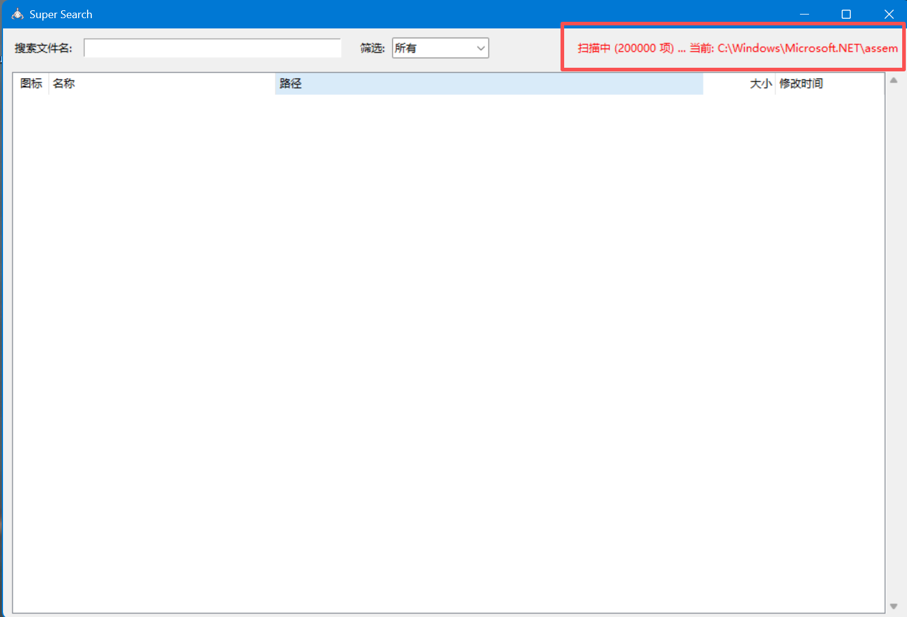

*(Comparison: Standard User Scan vs. Administrator Scan)* 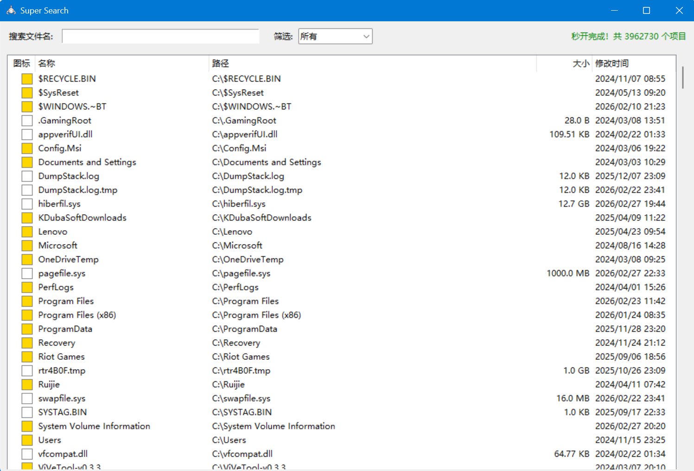
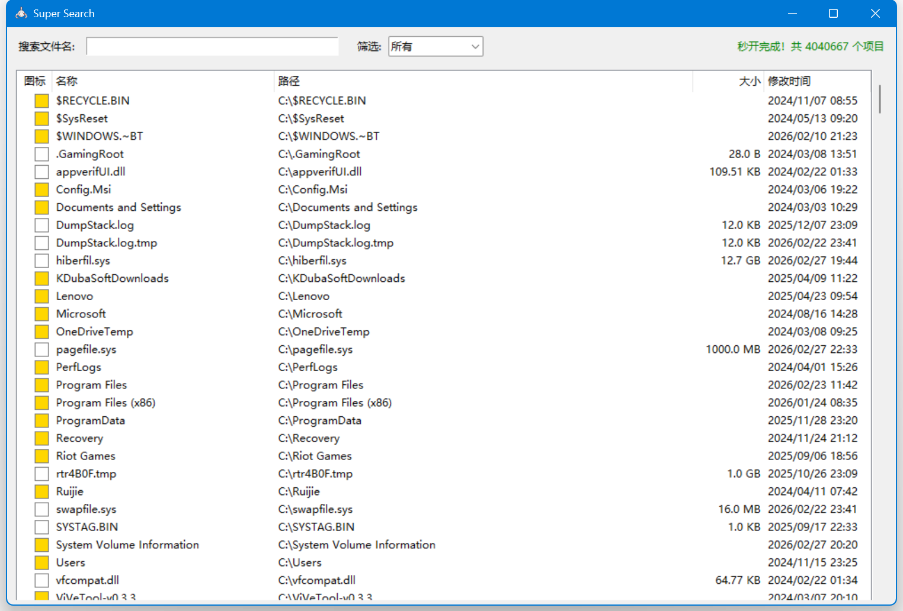

### 🌟 Core Functions Demonstration

* **Asynchronous Disk Scanning & Searching** The application supports keyword retrieval while a full-disk scan runs in the background. However, to ensure 100% complete search results during your first run, it is recommended to **wait until the bottom status bar displays "Loading Complete" before performing high-frequency searches**.

* **Precise Filtering & Right-Click Operations** The top bar supports quick filtering by broad categories such as "Documents, Images, Videos, Code." Within the search results, you can directly use the **right-click context menu** to: Open, Open File Location, Copy Path, or Delete.  
  *(Tip: Hold `Ctrl` or `Shift` while clicking the list for batch multi-selection and operations)* 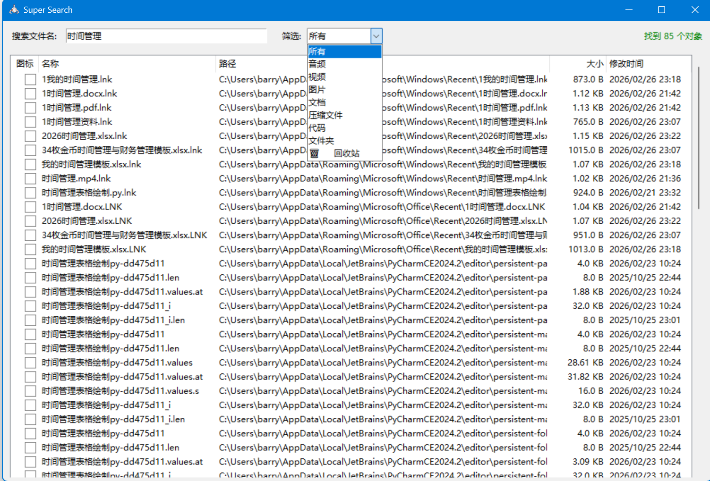  
  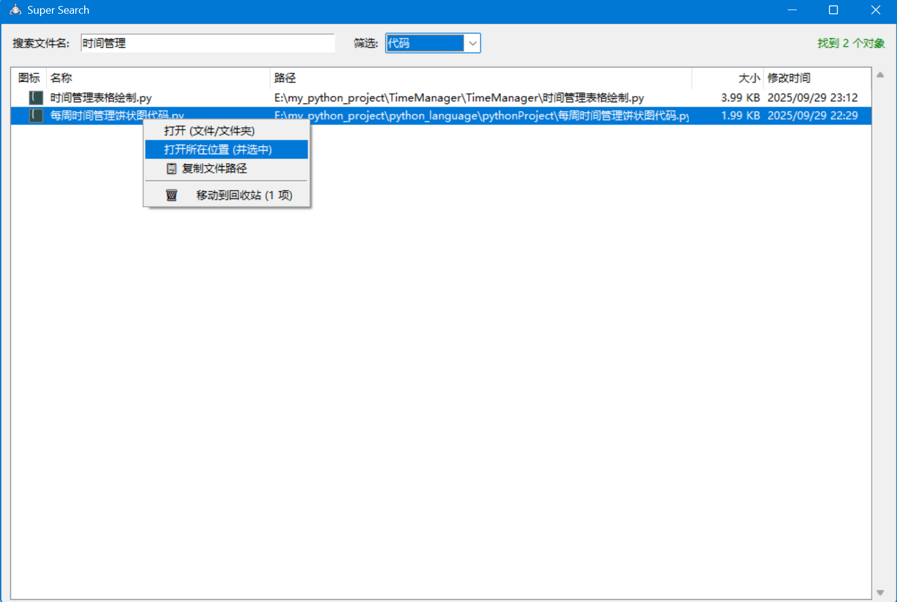  
  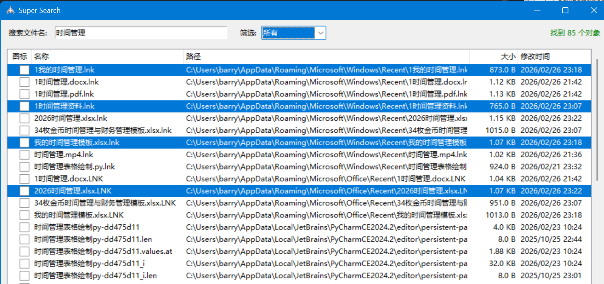

* **♻️ Exclusive Feature: Deep Recycle Bin Integration** Items marked with a **green ♻ icon** in the list indicate files currently in the system's Recycle Bin. You can right-click them directly in the search results to **Restore** or **Permanently Shred** them, saving you the hassle of digging through the Recycle Bin.  
  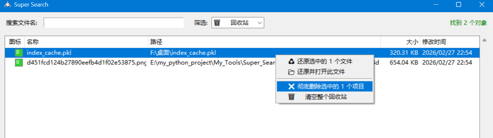

### 💻 Background Execution & Instant Startup

* **Silent System Tray Guardian** When you click the close button on the main interface, the program minimizes to the system tray in the bottom right corner by default. It silently monitors file changes in the background, always on standby.  
  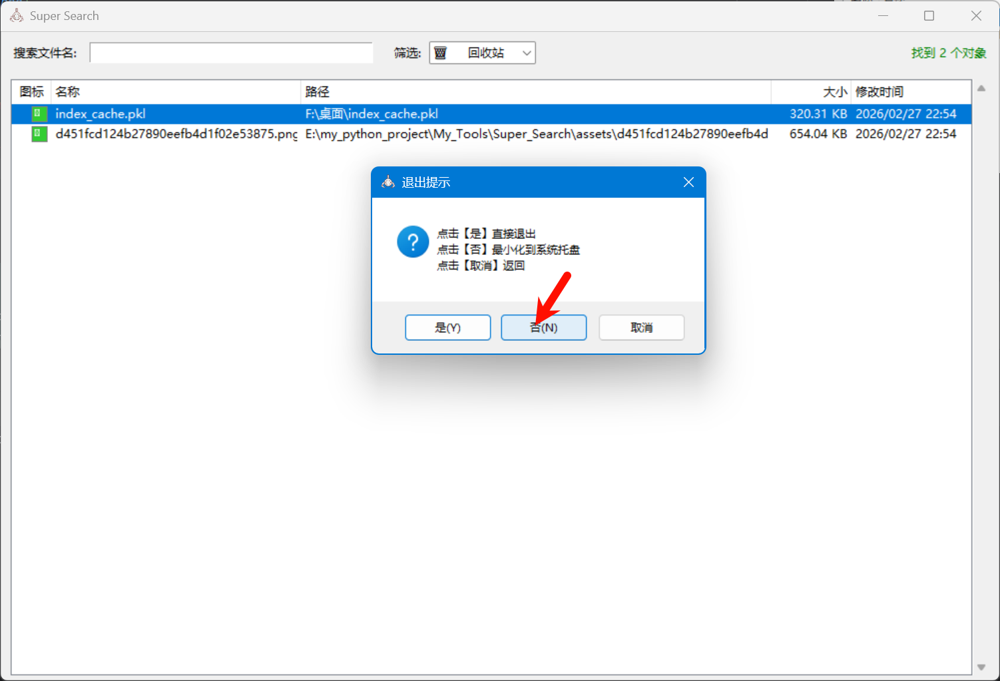  
  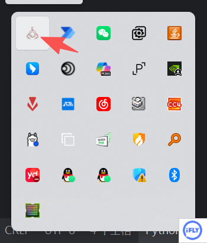

* **Index Snapshots & Zero-Delay Startup** When you completely exit the program, the system automatically generates a lightweight `.pkl` index snapshot locally. The next time you launch the program, it directly awakens the snapshot data, **skipping the lengthy disk-scanning process to achieve true "instant startup."** 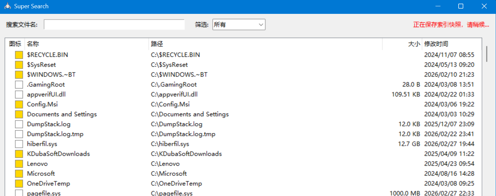  
  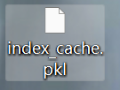  
  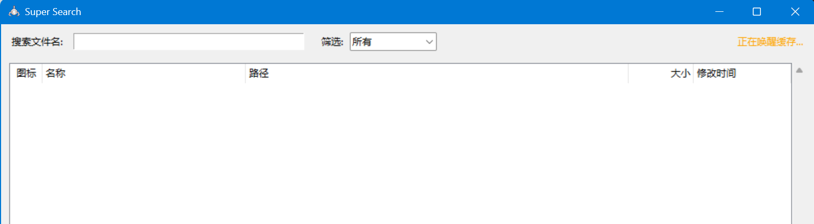  
  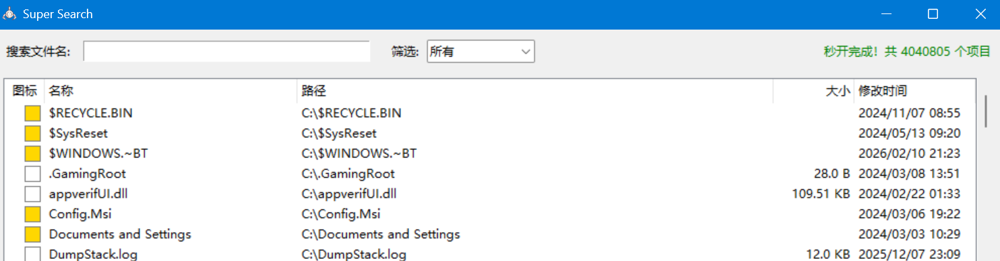

## 🛠️ Project Structure

```text
Super_Search/
├── src/                      # Core source code directory
│   ├── app_icon.ico          # Application icon
│   └── Super_Search.py       # Main entry point and core logic
├── .gitignore                # Git ignore configuration
├── LICENSE                   # GPL 3.0 Open Source License
├── README.md                 # Project documentation
└── requirements.txt          # Python dependency list
```
## 🚀 Quick Start

### 1. Prerequisites
This project is exclusively designed for the Windows platform. Please ensure you have Python 3.8 or higher installed on your computer.

### 2. Clone the Repository
```bash
git clone https://github.com/LuckyBoy9533/Super_Search.git
cd Super_Search
```
### 3. Install Dependencies
It is recommended to run this in a virtual environment. Execute the following command to install the core dependencies:
```bash
pip install -r requirements.txt
```
### 4. Run the Application
```bash
python src/Super_Search.py
```
## 📚 Core Tech Stack

* **GUI Framework**: tkinter (including ttk theme extensions)

* **Underlying APIs**: pywin32 (for calling Windows Shell and Recycle Bin COM interfaces)

* **File Monitoring**: watchdog (achieves millisecond-level file system change monitoring)

* **System Tray**: pystray + Pillow (manages background execution and taskbar icons)

## 📄 License

This project is licensed under the GPL 3.0 License.

*Copyright (c) 2026 Barry Allen*

*For commercial inquiries, please contact: zhang5626833@gmail.com*